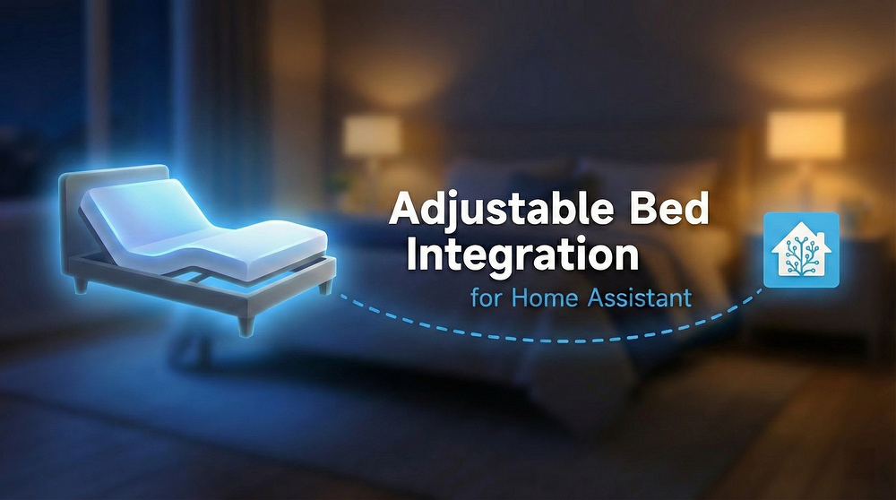

<p align="center">
  
</p>

<p align="center">
  <a href="https://github.com/kristofferR/ha-adjustable-bed/releases"></a>
  <a href="https://github.com/kristofferR/ha-adjustable-bed/actions/workflows/validate.yml"></a>
  <a href="https://github.com/hacs/integration"></a>
  
  <a href="https://github.com/sponsors/kristofferR"></a>
</p>

<p align="center">
  A Home Assistant custom integration for controlling smart adjustable beds via Bluetooth.
</p>

## Quick Start

v4 requires **Home Assistant 2026.9.0+**.
Back up Home Assistant before upgrading from v3;
see [compatibility and rollback](docs/HA_2026_9.md).

1. **Install** via [HACS](https://hacs.xyz): Search for "Adjustable Bed" and install
2. **Discover** your bed automatically, or add manually via Settings → Integrations
3. **Control** your bed from Home Assistant dashboards, automations, and voice assistants!

## Features

- **Native Dashboard Card** - Auto-loading Lovelace card that adapts to your bed ([details](#dashboard-card))
- **Paired Beds** - Left, Right, and Both controls for compatible split beds, with reversible conversion of existing entries
- **Motor Control** - Raise/lower head, back, legs, and feet
- **Position Control** - Position sliders in degrees or percentages, according to the controller
- **Memory Presets** - Jump to saved positions with one tap
- **Under-bed Lights** - RGB color control on supported beds, toggle on/off on others
- **Climate Controls** - Cooling, heating, and footwarming on supported beds
- **Massage Control** - Adjust massage intensity and patterns
- **Position Feedback** - See current angles on supported beds
- **Presence Sensors** - Occupancy sensors on supported beds
- **Firmness Controls** - Sleep Number settings on supported beds
- **Automations** - "Flat when leaving", "TV mode at 8pm", etc.

## Need Help?

| Guide | What's Inside |
|-------|---------------|
| **[Troubleshooting](docs/TROUBLESHOOTING.md)** | Connection issues, commands not working |
| **[Getting Help](docs/GETTING_HELP.md)** | Bug reports, support requests, diagnostics |
| **[Connection Guide](docs/CONNECTION_GUIDE.md)** | ESPHome proxy setup, finding your bed's address |
| **[Configuration](docs/CONFIGURATION.md)** | Settings, app profiles, combining and splitting beds |
| **[Actions and Automations](docs/SERVICES.md)** | Movement, memory, side targeting, and bed-specific actions |
| **[Apple Home and Siri](docs/HOMEKIT.md)** | Raise, lower, and stop commands through HomeKit scenes or Siri Shortcuts |
| **[Supported Actuators](docs/SUPPORTED_ACTUATORS.md)** | Protocol details, bed brand lookup |

See the [documentation index](docs/README.md) for migration and developer guides.

| | |
|---|---|
| 🐛 **[Report a Bug](https://github.com/kristofferR/ha-adjustable-bed/issues/new?template=bug-report.yml)** | Broken controls, connection failures, or regressions |
| 💡 **[Request a Feature](https://github.com/kristofferR/ha-adjustable-bed/issues/new?template=feature-request.yml)** | Missing capabilities and improvements |
| 🛏️ **[Request Bed Support](https://github.com/kristofferR/ha-adjustable-bed/issues/new?template=new-bed-support.yml)** | Unsupported bed brands or models |
| 💬 **[Ask a Question](https://github.com/kristofferR/ha-adjustable-bed/discussions/new?category=help-questions)** | How to configure or use the integration |
| ❤️ **[Praise and Feedback](https://github.com/kristofferR/ha-adjustable-bed/discussions/131)** | Share your experience or say thanks |

Issues track work; Discussions host help and community conversations. You do not
need to prove a problem is a bug before reporting it. See [how reports are
handled](docs/GETTING_HELP.md#how-reports-are-handled).

<details>
<summary><b>Quick troubleshooting</b></summary>

1. **Check range** - Bluetooth adapter or proxy within ~10m of bed
2. **Disconnect other apps** - Most beds allow only one BLE connection
3. **Reload integration** - Settings → Devices & Services → Adjustable Bed → Reload
4. **Enable debug logs** - Settings → Devices & Services → Adjustable Bed → ⋮ menu → Enable debug logging. Reproduce issue, then disable to download logs.

</details>

## ❤️ Support the project

Enjoying Adjustable Bed? Sponsoring its development is a lovely way to say thanks and help keep the project growing.

[](https://github.com/sponsors/kristofferR)

<p align="center">
  
</p>

## Supported Beds

The entries below identify motor/actuator manufacturers or supported app profiles. Your bed might use one of these internally - check the [Supported Actuators guide](docs/SUPPORTED_ACTUATORS.md) to find your bed brand.

| Actuator or profile | Example brands or models |
|---------------------|--------------------------|
| ✅ [Linak](docs/beds/linak.md) | Tempur-Pedic, Bedre Nætter, Jensen |
| ✅ [Keeson](docs/beds/keeson.md) | Ergomotion, Tempur, Beautyrest, King Koil, Member's Mark, Purple, GhostBed, ErgoSportive |
| ✅ [Richmat](docs/beds/richmat.md) | Casper, MLILY, Sven & Son, Avocado, Luuna, Jerome's |
| 🧪 [RMControl product profiles](docs/beds/rmcontrol.md) | Explicit Richmat RMControl 21.3.7 product catalogs; hardware unverified |
| ✅ [MotoSleep](docs/beds/motosleep.md) | HHC, Power Bob, binary MOTO models |
| ✅ [Octo](docs/beds/octo.md) | Octo |
| ✅ [Solace](docs/beds/solace.md) | Solace, Sealy, Woosa Sleep, QMS |
| ✅ [Leggett & Platt](docs/beds/leggett-platt.md) | Leggett & Platt, Prodigy Comfort Elite / Prodigy CE |
| 🧪 [Prodigy / U Series app profiles](docs/beds/leggett-okin.md) | Prodigy 2L, Prodigy 2, Prodigy 4 and U / Ultra Series (BLE profiles and timers) |
| 🧪 [L&P Adjustable Base, legacy app](docs/beds/lp-legacy.md) | Explicit app remote layouts from `com.richmat.lp` 2.2.1; hardware unverified |
| ✅ [Reverie](docs/beds/reverie.md) | Reverie |
| ✅ [Okimat/Okin](docs/beds/okimat.md) | Lucid, CVB, Smartbed, RF ECO BT bed receivers |
| ✅ [Okin 64-Bit](docs/beds/okin-64bit.md) | NORA_CON / NORACON Mattress Firm controllers |
| ✅ [Jiecang](docs/beds/jiecang.md) | Glideaway, Dream Motion, LOGICDATA |
| 🧪 [Jiecang app profiles](docs/beds/jiecang-app.md) | ERGOBALANCE 1.0.8 and Dream Motion 1.0.5, explicit layouts; hardware unverified |
| ✅ [Kaidi](docs/beds/kaidi.md) | Rize Remedy III / newer Mouselet-based Rize beds, Floyd Home, ISleep |
| ✅ [Limoss](docs/beds/limoss.md) | Limoss, Stawett |
| ✅ [Jensen](docs/beds/jensen.md) | Jensen (JMC400, LinON Entry) |
| ✅ [Svane](docs/beds/svane.md) | Svane |
| ✅ [DewertOkin](docs/beds/dewertokin.md) | Many older Rize models, Simmons, Nectar, Resident, Symphony |
| ✅ [Serta](docs/beds/serta.md) | Serta Motion Perfect |
| ✅ [Mattress Firm 900](docs/beds/mattressfirm.md) | iFlex / older Nordic UART bases |
| ✅ [Nectar](docs/beds/nectar.md) | Nectar |
| ✅ [Malouf/Lucid](docs/beds/malouf.md) | Malouf, Lucid, Structures |
| ✅ [BedTech](docs/beds/bedtech.md) | BedTech |
| ✅ [Sleep Number](docs/beds/sleep_number.md) | Climate 360, FlexFit, FlexFit Smart, i8 / 360 FlexFit 2 |
| ✅ [Sleepy's Elite](docs/beds/sleepys.md) | Sleepy's |
| ✅ [SleepSpa S9000AI](docs/beds/sleepstar.md) | SleepSpa S9000AI (`SLEEPSTAR`) |
| ✅ [Vibradorm](docs/beds/vibradorm.md) | Vibradorm |
| ✅ [SUTA Smart Home](docs/beds/suta.md) | SUTA |
| ✅ [TiMOTION AHF](docs/beds/timotion-ahf.md) | TiMOTION |
| ✅ [Rondure](docs/beds/rondure.md) | 1500 Tilt Base |
| ✅ [Remacro](docs/beds/remacro.md) | CheersSleep, Jeromes, Slumberland, The Brick |
| ✅ [Cool Base](docs/beds/coolbase.md) | Cool Base (Keeson with fan) |
| ✅ [Scott Living](docs/beds/scott-living.md) | Scott Living |
| ✅ [SBI/Q-Plus](docs/beds/sbi.md) | Q-Plus (Costco) |
| ✅ [Logicdata](docs/beds/logicdata.md) | SILVERmotion, SimplicityFrame |
| 🧪 [LOGICDATA app profiles](docs/beds/logicdata-app.md) | MOTIONrelax phone and tablet apps, explicit standard/middle layouts |
| ✅ [Okin CB35](docs/beds/okin-cb35.md) | Sealy Posturematic |
| ✅ [DewertOkin ELEVATE](docs/beds/star-elevate.md) | ELEVATE two-actuator lift accessory |
| ✅ [Okin CST](docs/beds/okin-cst.md) | Rize Sanctuary, Resident, Aviada, Bob, Contempo, II Carefree, II Clarity, MF900; Support; Mattress Firm 900-O / MFirm 900-O; Nectar Motion |
| ✅ [OKIN Smart Remote / RF ECO BT](docs/beds/okin-rf-eco-bt.md) | Elda BTH / MEGAMAT staircase actuator |
| ✅ [Okin DOT](docs/beds/okin-dot.md) | DewertOkin RF1058/RF34/RF6707 handset beds |

✅ marks supported families; 🧪 marks explicitly selected app profiles whose
hardware validation is pending. Support for a family does not establish that
every model or feature has been physically tested. Each protocol guide records
its evidence and remaining hardware limitations.

**Have one of these?** [Let us know](https://github.com/kristofferR/ha-adjustable-bed/issues) how well it works!

Some brands use more than one controller family. Let auto-detection identify
the controller, or consult the [brand and protocol guide](docs/SUPPORTED_ACTUATORS.md)
when choosing manually.

## Will This Work With My Bed?

**Just try it!** The integration auto-detects most beds. Install it and see if your bed shows up.

**Didn't auto-detect?** Check the [Supported Actuators guide](docs/SUPPORTED_ACTUATORS.md) to find your bed's actuator brand, then add it manually.

**Still stuck?** [Open an issue](https://github.com/kristofferR/ha-adjustable-bed/issues) with your bed brand/model and we'll help!

**Other beds:** [Eight Sleep](https://github.com/lukas-clarke/eight_sleep) has its own integration.

**WiFi and cloud-based beds [won't be supported](https://github.com/kristofferR/ha-adjustable-bed/issues/167)** — this is a Bluetooth-only integration for the reasons stated in the link.

## Installation

v4 requires **Home Assistant 2026.9.0 or newer**. See the [compatibility and migration notes](docs/HA_2026_9.md).

**Before upgrading from v3, save a Home Assistant backup.** v4 migrates stored
configuration; reinstalling v3 alone cannot undo it. Follow the
[backup and rollback instructions](docs/HA_2026_9.md#backup-and-rollback).

### HACS (Recommended)

1. Open HACS in Home Assistant
2. Search for "Adjustable Bed"
3. Install/download the latest stable version
4. Restart Home Assistant

### Manual

Use a v4 release archive, or check out `master` for the current development
code. Copy `custom_components/adjustable_bed` to your
`config/custom_components/` directory and restart. The committed frontend bundle
is included; an end-user installation does not require Bun or a frontend build.

## Configuration

Your bed should auto-discover via Bluetooth. If not:

1. Go to **Settings** → **Devices & Services** → **Add Integration**
2. Search for "Adjustable Bed"
3. Enter your bed's Bluetooth address or select from discovered devices

To adjust settings after setup, click **Configure** (the gear icon) for the
integration entry in Settings → Devices & Services, then **Change settings**.

<details>
<summary><b>Quick reference</b></summary>

| Setting | Description |
|---------|-------------|
| Motor Count | 2 (back/legs), 3 (adds head), or 4 (adds feet); Standard Octo RTV TV lifts use 1 |
| Has Massage | Enable if your bed has massage |
| Protocol Variant | Usually auto-detected, override if needed |
| Motor Pulse Settings | Fine-tune movement timing |
| Disable Angle Sensing | Turn off for supported position feedback; turn on if monitoring conflicts with the remote |
| Disconnect After Command | Release the connection one second after operations finish, where supported |
| Jensen PIN | 4-digit PIN for Jensen beds (default: 3060) |
| Octo PIN | 4-digit PIN for Octo beds that require authentication |
| Richmat Remote | Remote model code for Richmat beds |

See the [Configuration Guide](docs/CONFIGURATION.md) for all options.

</details>

## Dashboard Card

The integration ships a native Lovelace card, **Adjustable Bed Card**, that
gives you a complete control panel for your bed — position controls, presets,
memory, lighting, massage, climate, and connection — all in the Home Assistant
theme. It registers and loads automatically; you do not need to add a
HACS/Lovelace resource manually. If Home Assistant was open in your browser
during an integration update, reload that page once after restarting Home
Assistant so the browser picks up the updated card module.

If the card is missing or shows a configuration error, see the
[dashboard card troubleshooting guide](docs/TROUBLESHOOTING.md#dashboard-card-missing-or-configuration-error).

To add it: edit a dashboard → **Add Card** → search for **Adjustable Bed**, then
pick your bed device. Selecting one of the
bed's entities first also suggests the Adjustable Bed Card. Or in YAML:

```yaml
type: custom:adjustable-bed-card
device_id: <your bed device>
```

The card adapts to your bed — it only shows the sections your bed actually
exposes (e.g. massage and climate appear only on beds that support them), so the
same card works for every supported bed.

### Movement and paired beds

Hold an Up/Down control to repeat movement; release it to send STOP. Each repeat
is a finite controller operation, so a hold can have short pauses between pulses.
Position sliders appear only when the selected controller exposes them.

For a combined bed, the card offers **Left / Both sides / Right**. Selecting
either the parent device or a side's child device opens the paired card. Both-side
controls expose shared capabilities; select a side for its additional features.
The **Match both to** controls copy the selected side's reported positions to the
other side when both provide the required feedback. This is a one-time move.

See [paired-bed configuration](docs/CONFIGURATION.md#two-independent-frames-in-v4)
and [action targeting](docs/SERVICES.md#targeting-a-bed-or-side) for setup and
automation behavior.

### Compact room cards

In the visual editor, choose **A · Glance only**, **B · Quick actions**, or
**C · Compact controls**. These are starting points for the same card, and every
option remains editable. Existing cards keep their full layout.

- **Glance:** both bed positions, with optional title and side names. Turn off the
  title and readouts for a graphic-only tile.
- **Quick actions:** the dual graphic, side selector, selected presets or memory
  recalls, and Stop. Choose and reorder favourites in the editor.
- **Controls:** adds the supported hold-to-move motor rows.

Both silhouettes remain visible when switching the action target. Hide the side
selector to use a fixed target; the card labels that target when controls are
shown. Native pairs store a child device ID, so renaming a side cannot reroute
commands. Stop remains available with movement controls and retains targets of
movement started by this card across side changes. Compact mode never saves
memory positions. Preset buttons are disabled when the target exposes neither a
Stop action nor motor covers that can be stopped.

Title, graphic, readouts, motor rows, lighting, and connection status are optional.
Configure a local **Full view path** to open another dashboard view from the title
or graphic. Position animation follows real degree readings, honours reduced
motion, and does not loop while idle. Unknown positions show an explicit fallback;
percentage feedback is shown as text rather than converted into an invented angle.

```yaml
type: custom:adjustable-bed-card
device_id: <your bed device>
layout: compact
show_header: true
compact_labels: angles        # angles, names, or none
show_side_selector: true
default_target: both          # both, child device ID, or left/right for a one-address pair
compact_actions:             # ordered preset translation keys; [] for no quick actions
  - preset_flat
  - preset_memory_1
show_motors: false
show_lighting: false
show_connection: false        # compact side statuses, not connection buttons
animate: true
navigation_path: /dashboard-bedroom/bed  # optional local HA path
```

Omit `compact_actions` for Flat plus the first available memory recall (or another
preset when no memory recall exists). Only actions supported by the selected target
appear; entity names and icons are preserved. Compact controls are off by default
except for these quick actions. The other `show_*` sections and `section_order`
apply to the full layout. Memory saving and position synchronization stay there.

For frontend development, run `bun run check`, `bun test`, and `bun run test:browser`
from `custom_components/adjustable_bed/frontend`. The browser checks use synthetic
HA state and recorded service calls, and require Chromium (or `CHROMIUM_PATH`).

### Customizing the card

Everything is configurable from the card's **visual editor** (no YAML needed):

- **Show/hide sections** — toggle Position, Firmness, Presets, Memory, Lighting,
  Massage, Utility, Climate, Connection, and the bed-angle graphic on or off. Only the
  sections your bed has are listed.
- **Reorder sections** — use the up/down arrows next to each section to change
  the order they appear on the card.
- **Choose which memory positions to show** — pick exactly the memory slots you
  use instead of showing all of them.

**Recalling and saving positions.** In the Memory section, tap a position to
move the bed to it. To store the bed's *current* position, tap **Save…** in the
Memory header, then tap the position you want to overwrite (tap **Cancel** to
back out). The Save button only appears for beds that support saving.

**Names and icons follow your entities.** The card displays each control using
its entity's own name and icon, so to relabel something you just rename the
entity (Settings → Devices & Services → your bed → the entity → ⚙). For example,
rename **Memory 1** to *"Flat"* and give it a bed icon, and the card's first
memory tile becomes a bed icon labelled "Flat". This is purely cosmetic and
local to you — the card finds entities by the integration's internal keys, so
renaming or re-icon-ing never breaks it, and other users keep the tidy defaults
(*Memory 1–6* with numbered icons).

<details>
<summary><b>YAML options</b></summary>

```yaml
type: custom:adjustable-bed-card
device_id: <your bed device>   # the bed to control (the card prompts you to pick one if omitted)
name: Bedroom Bed              # optional, overrides the card title
section_order: [motors, memory, lighting]  # optional, render order (default order otherwise)
memory_save: true              # optional, show the "Save…" button (default: true)
memory_slots: [1, 2, 3]        # optional, which memory positions to show (default: all)
# Each section defaults to shown; set to false to hide:
show_graphic: true
show_motors: true
show_firmness: true
show_presets: true
show_memory: true
show_lighting: true
show_massage: true
show_utility: true
show_climate: true
show_connection: true
```

</details>

## Bluetooth Setup

Works with Home Assistant's native Bluetooth:
- **Local adapter** on your HA host
- **[ESPHome Bluetooth Proxy](https://esphome.io/components/bluetooth_proxy.html)** for extended range

See the [Connection Guide](docs/CONNECTION_GUIDE.md) for setup help.

## Contributing

**We'd love your help!** This integration is actively developed and we're especially looking for:

- **Testers** - Own a bed we haven't fully tested? Your feedback is invaluable
- **Bug reports** - Found something wrong? [Open an issue](https://github.com/kristofferR/ha-adjustable-bed/issues)
- **Code contributions** - PRs welcome!

For v4 changes, work from `master`. See the [developer documentation](docs/README.md#development-and-validation)
for environment setup, validation, architecture, and the APK Protocol Audit workflow.

## Credits

Massive thanks to the [smartbed-mqtt](https://github.com/richardhopton/smartbed-mqtt) developers for their pioneering work reverse-engineering bed protocols!

<details>
<summary><b>Migrating from smartbed-mqtt?</b></summary>

This integration replaces smartbed-mqtt with several advantages:
- Uses Home Assistant's native Bluetooth (no ESPHome API issues)
- Works seamlessly with ESPHome Bluetooth proxies
- No MQTT broker required
- Native HA entities

To migrate: Install this integration, configure your bed, verify it works, then remove smartbed-mqtt.

</details>

## License

MIT License - see [LICENSE](LICENSE) for details.
